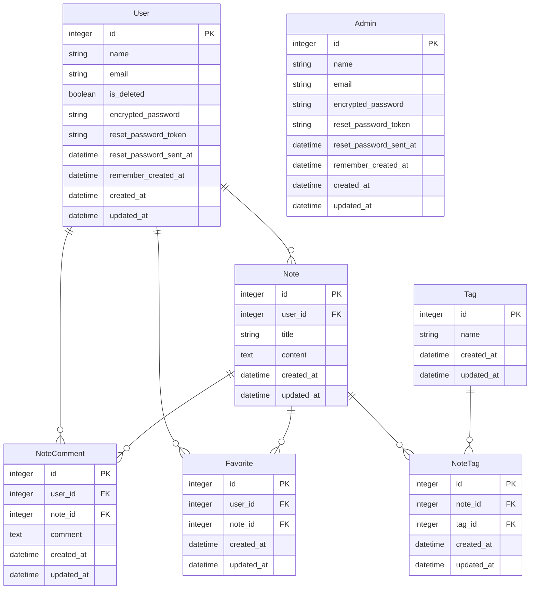

# Term

## サイト概要
### サイトテーマ
プログラミング関連の用語を記録・管理できる用語集アプリ  
他人の用語集を参考にしたりコメントやいいねができるコミュニティサイトとして利用することもできます。  

### テーマを選んだ理由
プログラミング関連の用語であったりコマンドやメソッドの使い方がわからない時に  
インターネットを検索して問題を解決すると思いますが、  
何度も調べたことがあるコマンドやメソッドであるにも関わらず、  
インターネット検索と複数サイトの探索を繰り返してしまうということがよくありました。  
そこで、問題解決の時間を少しでも短縮したり、記憶定着の助けになるような用語集アプリがあると便利だと思いこのテーマにしました。  

### ターゲットユーザ
- プログラミング関連の用語をインプット＆アウトプットし記憶に定着させたい人
- 自分専用の用語集を育てたい人
- 他人の用語集を参考にしたい人
- 用語集から用語の意味やコマンドの使い方を検索したい人

### 主な利用シーン
- インターネットなどで調べた内容を記録したい時
- 記録した内容を検索したい時
- 記録した内容を復習したい時
- 他人の記録内容を参考にしたい時

## 設計書
- ER図

## 開発環境
- OS：Linux(CentOS)
- 言語：HTML,CSS,JavaScript,Ruby,SQL
- フレームワーク：Ruby on Rails
- JSライブラリ：jQuery
- IDE：Cloud9

## 使用素材
使用検討中です
